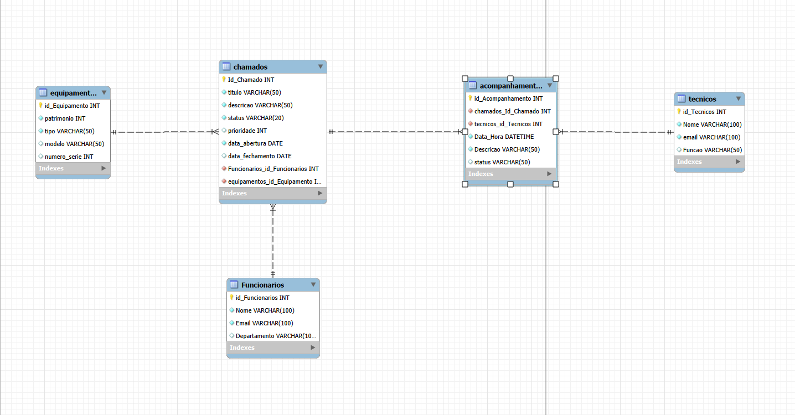

# Sistema de Helpdesk (Central de Chamados de Suporte Técnico)

[](https://www.python.org/)
[](https://www.mysql.com/)

Sistema completo de gerenciamento de chamados de suporte técnico, desenvolvido para integrar um banco de dados MySQL com uma aplicação Python.

**Equipe:**
- Adna Cecília
- Fernando Carvalho
- Mário Rocha
- Nathiara Santos
- Saul

---

## 📋 Tema Escolhido

O sistema modela uma **Central de Chamados de Suporte Técnico (Helpdesk)** corporativa, onde funcionários podem registrar problemas técnicos associados a equipamentos de informática. A equipe de TI realiza acompanhamentos técnicos, atualizando o status dos chamados até sua conclusão.

### Objetivos do Negócio
- **Rastreamento de Ativos**: Vincular precisamente equipamentos aos chamados
- **Histórico Completo**: Registrar todas as interações técnicas
- **Gerenciamento de Fluxo**: Permitir múltiplos técnicos por chamado

---

## 🗄️ Decisões de Modelagem (3FN)

O banco foi projetado na **Terceira Forma Normal (3FN)** com 5 entidades:

### Entidades

| Entidade | Descrição | Relacionamento |
|----------|-----------|----------------|
| **funcionarios** | Usuários que abrem chamados | 1:N com chamados |
| **equipamentos** | Ativos físicos da empresa | 1:N com chamados |
| **tecnicos** | Equipe de suporte | 1:N com acompanhamentos |
| **chamados** | Tickets de suporte | 1:N com acompanhamentos |
| **acompanhamentos** | Entidade associativa | Resolve N:N |

### Resolução do Relacionamento N:N

A entidade **acompanhamentos** resolve o relacionamento N:N entre chamados e técnicos:

- **Chave própria**: `id_acompanhamento` (surrogate key autoincremental)
- **Justificativa**: Permite múltiplos registros do mesmo par (técnico, chamado) ao longo do tempo

### Normalização

- **1FN**: Atributos atômicos, sem colunas repetidas
- **2FN**: Chaves primárias de coluna única, sem dependências parciais
- **3FN**: Sem dependências transitivas (ex: não armazenamos telefone do departamento na tabela de funcionários)

---

## 📊 Diagrama Entidade-Relacionamento (DER)



O diagrama foi modelado em notação **Crow's Foot** (Pé de Galinha).

---

## 🚀 Como Executar o Projeto

### Pré-requisitos

- Python 3.8 ou superior
- MySQL Server 8.0
- mysql-connector-python

### 1. Instalação

```bash
# Clonar o repositório
git clone https://github.com/seu-usuario/helpdesk-system.git
cd helpdesk-system

# Instalar dependências
pip install mysql-connector-python


helpdesk-system/
├── README.md
├── sql/
│   └── schema.sql
├── python/
│   └── helpdesk_app.py
├── der/
│   └── der_helpdesk.png
└── .gitignore
